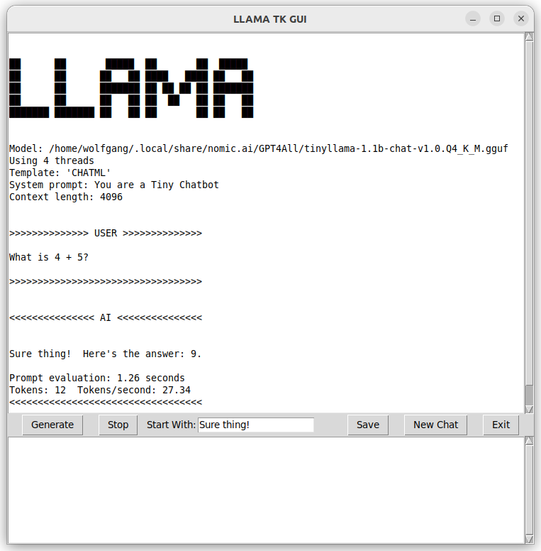

# LLAMA_TK_CHAT
Simple chat interface for local AI using llama-cpp-python and llama-cpp-agent

## Quickstart

The TK GUI is based on `llama-cpp-python`, `llama-cpp-agent`, `typer`, and `tkinter` package
(install them with pip install ...).

The GUI is a self-contained Python script named `LLAMA_TK_GUI.py`. As long as
its package dependencies are present, you can download and run it from wherever you like.

Specify the path to the model with the `-m`/`--model` argument and an optional prompt template with `-f`/`--format` (default: `CHATML`, Options: MIXTRAL, CHATML, VICUNA, LLAMA_2, SYNTHIA, NEURAL_CHAT, SOLAR, OPEN_CHAT, ALPACA, CODE_DS, B22, LLAMA_3, PHI_3)
The prompt template is only used if the .gguf does not contain the appropriate template.
A system prompt can be set with `-s`/`--sysprompt`.
Context length defaults to 2048, it can be set with `-c`/`--context-length`. The number of threads can be set with `-t`/`--n-threads`.
Everything runs on CPU.

Input your request in the bottom window and click ```Generate```.

Inference can be interrupted using the ``Stop`` button.

 


